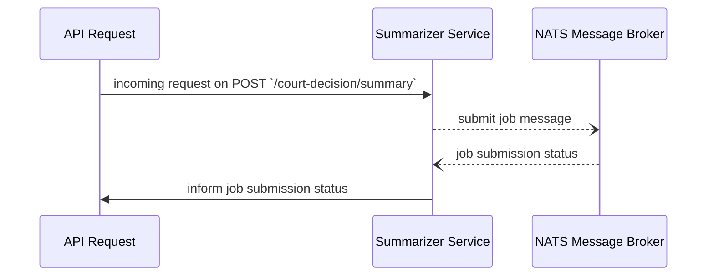
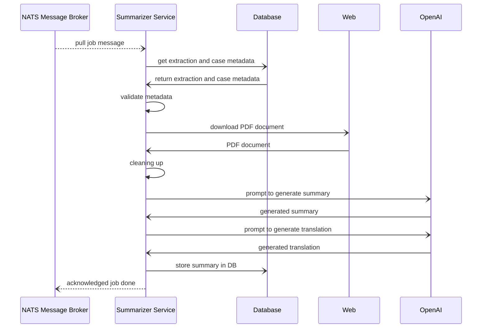

# indonesia-supreme-court-ai-postprocess

# How to Deploy

1. Prepare the `.env` file, see `.env.example` for the configuration
2. run `docker compose up --build` ( to force rebuild, if no code change, omit the `--build`)
3. This will run the service in port `8080` if you want to change the port, just modify the exposed port and the build arg `SERVICE_PORT` in the docker compose file

# API Docs

After running the service, go tom `localhost:8080/docs`

# Process Flows

## Incoming Summarization Job Request

## Background Processing

